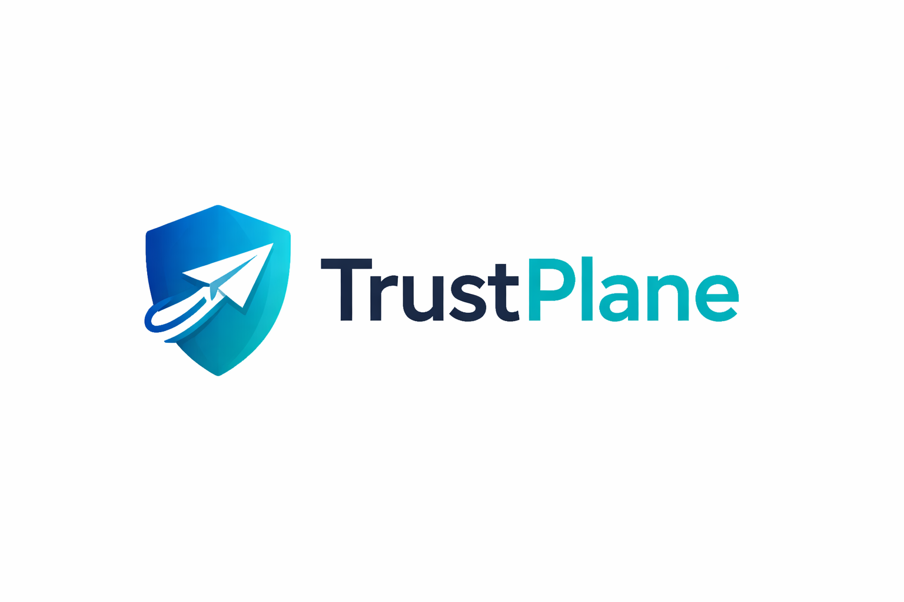

# TrustPlane



**The AI Trust Control Plane for production LLM systems.**

TrustPlane gives your legal and compliance team what they need to sign off on AI deployment: a documented risk policy, an immutable audit trail, and automatic escalation to human review when confidence drops.

Powered by [CognOS](https://github.com/base76-research-lab/cognos-proof-engine) — an auditable epistemic risk engine with published theoretical foundations.

---

## The risk your organization is carrying

Every unverified LLM response in a production system is an undocumented decision. When something goes wrong — a hallucinated figure in a financial report, an incorrect medical reference, a legal citation that doesn't exist — there is no record of what the model was asked, what it answered, or what your system decided to do with it.

That is a liability exposure. In regulated industries, it is a compliance failure.

TrustPlane intercepts every LLM request, scores it for epistemic uncertainty, enforces your risk policy, and logs the decision — before the response reaches your users.

---

## How it works

Every request is scored using the epistemic trust formula:

```
C = p × (1 − Ue − Ua)
```

- `p` — prior confidence for this request type
- `Ue` — epistemic uncertainty (what the model doesn't know)
- `Ua` — aleatoric uncertainty (irreducible noise in the domain)

The score determines the outcome:

| Trust score | Decision | Action |
|---|---|---|
| Above threshold | `PASS` | Request forwarded |
| Threshold − 0.2 | `REFINE` | Warning headers, logged |
| Threshold − 0.4 | `ESCALATE` | Webhook triggered, human notified |
| Below minimum | `BLOCK` | Request rejected, trace saved |

Every response carries the decision in its headers:

```
X-TrustPlane-Score: 0.8731
X-TrustPlane-Decision: PASS
X-TrustPlane-Trace-Id: tr_a3f91c2d44b1
X-TrustPlane-Policy: enterprise_v1
```

---

## Evidence base

The scoring model is open source, auditable, and grounded in published theory.

**OSS core:** [cognos-proof-engine](https://github.com/base76-research-lab/cognos-proof-engine) — the scoring engine is MIT-licensed and independently verifiable. The formula, thresholds, and policy engine are all inspectable.

**Published research:** The Field-Node-Cockpit (FNC) framework underlying the model has been through peer review. Full publication record at [Applied AI Philosophy](https://github.com/Applied-Ai-Philosophy).

**Falsifiability:** A system calibrated to `target_risk: 0.3` escalates measurably more than one set to `0.7`. This is testable against your own request logs — not a marketing claim.

If your security team, legal counsel, or compliance officer needs to understand how the scoring works, there is source code and published theory to show them.

---

## Capabilities

### Pluggable LLM backend
One control plane. Every provider. Switch without changing application code.

```yaml
provider: ollama          # On-premise, air-gapped
provider: openai          # GPT-4o, o1, o3
provider: anthropic       # Claude Sonnet, Claude Opus
provider: groq            # High-throughput inference
provider: cerebras        # Low-latency inference
```

Fallback providers configurable for zero-downtime failover.

### Multi-tenant isolation
PostgreSQL schema-per-tenant. No data shared between organizations.

```
tenant_acme.traces
tenant_globocorp.traces
tenant_healthsystem.traces
```

### Human oversight triggers
Webhook dispatch on ESCALATE and BLOCK. Your incident management system receives the signal before your users receive the response.

```json
{
  "trace_id": "tr_a3f91c2d44b1",
  "decision": "ESCALATE",
  "trust_score": 0.31,
  "tenant_id": "acme",
  "timestamp": "2026-03-02T14:22:11Z"
}
```

### Audit trail
Complete trace history for every request. Exportable as CSV or EU AI Act Article 13 PDF report.

```bash
curl -H "X-API-Key: your-key" \
  "https://your-gateway/v1/audit/export?format=pdf&from=2026-01-01" \
  -o compliance_report.pdf
```

In air-gapped deployments, audit trail integrity is enforced through physical and network isolation — the same model used in defense, healthcare, and public sector infrastructure. No external process can reach the database. For deployments requiring additional guarantees, WAL archiving to write-once storage can be added above TrustPlane.

### Deployment options
Self-hosted via Docker Compose (air-gap compatible) or SaaS. Your data never has to leave your environment.

---

## Claude Code & Anthropic API

TrustPlane integrates with Anthropic in two directions.

**Claude as LLM backend** — any Claude model behind the trust-scoring gateway:

```yaml
provider: anthropic
model: claude-sonnet-4-6
api_key: ${ANTHROPIC_API_KEY}
target_risk: 0.3
```

**TrustPlane as MCP server for Claude Code** — expose trust verification as tools Claude Code can call during its own reasoning:

```json
{
  "mcpServers": {
    "trustplane": {
      "command": "python",
      "args": ["/path/to/Cognos-enterprise/mcp/server.py"],
      "env": {
        "COGNOS_BASE_URL": "http://127.0.0.1:8788",
        "COGNOS_API_KEY": "your-key"
      }
    }
  }
}
```

Full setup guide: [mcp/CLAUDE_CODE_SETUP.md](mcp/CLAUDE_CODE_SETUP.md)

---

## Quickstart

```bash
git clone https://github.com/base76-research-lab/Cognos-enterprise.git
cd Cognos-enterprise
cp .env.example .env        # Set COGNOS_PROVIDER + API key
docker-compose up

curl -X POST http://localhost:8788/v1/chat/completions \
  -H "X-API-Key: test-key" \
  -H "X-Cognos-Tenant: demo" \
  -H "Content-Type: application/json" \
  -d '{"model":"ollama/llama3.2:1b","messages":[{"role":"user","content":"Hello"}]}'
```

---

## Architecture

```
┌─────────────────────────────────────────────────────┐
│                  Your Application                    │
└─────────────────────────┬───────────────────────────┘
                          │
                          ▼
┌─────────────────────────────────────────────────────┐
│                    TrustPlane                        │
│                                                     │
│   Auth & RBAC  →  Trust Scoring  →  Policy Engine   │
│                   C=p(1−Ue−Ua)     PASS/REFINE/     │
│                                    ESCALATE/BLOCK    │
│                                         │           │
│   Rate Limiting    Tenant Isolation     │           │
│   (Redis)          (per-schema PG)      │           │
│                                         ▼           │
│              ┌──────────────────────────────────┐   │
│              │         Provider Router           │   │
│              └───┬──────┬──────┬──────┬─────────┘   │
└──────────────────┼──────┼──────┼──────┼─────────────┘
                   │      │      │      │
                Ollama  OpenAI  Anthropic  Groq/Cerebras
```

Full diagram: [docs/ARCHITECTURE.md](docs/ARCHITECTURE.md)

---

## EU AI Act compliance

Designed for organizations operating high-risk AI systems under EU AI Act Annex III.

| Article | Requirement | How TrustPlane addresses it |
|---|---|---|
| Art. 9 | Risk management system | Continuous epistemic scoring on every inference |
| Art. 12 | Record-keeping | Immutable trace log with trace IDs and timestamps |
| Art. 13 | Transparency | Automated PDF reports with full attestation summary |
| Art. 14 | Human oversight | Webhook escalation before downstream consequences |

Full compliance guide: [docs/EU_AI_ACT.md](docs/EU_AI_ACT.md)

→ [Technical whitepaper](docs/WHITEPAPER.md) — theory, implementation, limitations, EU AI Act mapping

## Use case scenarios

Detailed deployment scenarios with architecture diagrams:

- [Healthcare AI with automatic escalation](docs/scenarios/healthcare.md) — Clinical documentation, air-gapped Ollama, strict `target_risk: 0.05`
- [Legal AI with compliance audit trail](docs/scenarios/legal.md) — Contract analysis, Anthropic backend, 7-year retention
- [Public sector sovereign deployment](docs/scenarios/public-sector.md) — Air-gapped, national data sovereignty, full EU AI Act mapping

---

## Pricing

### Free
Open-source core. 1 tenant. 100 requests/day. CSV export.
→ [cognos-proof-engine](https://github.com/base76-research-lab/cognos-proof-engine) (MIT)

### SaaS — from €499/month per tenant
Hosted. Zero infrastructure. Full enterprise feature set.

### Self-hosted license — from €25,000/year
Your infrastructure. Air-gap compatible. Full source access.

### Enterprise consulting
Architecture review, policy calibration, compliance documentation, ongoing support.
For healthcare, legal, finance, and public sector deployments.

Contact: [bjorn@base76.se](mailto:bjorn@base76.se)

---

## Free vs Enterprise

| Feature | Free | Enterprise |
|---|---|---|
| Trust scoring (PASS/REFINE/ESCALATE/BLOCK) | ✓ | ✓ |
| All LLM providers | ✓ | ✓ |
| Trace history + CSV export | ✓ | ✓ |
| Webhooks | 1 endpoint / 100 events/day | Unlimited |
| Tenants | 1 | Unlimited |
| Rate limit | 100 req/day | Configurable |
| PDF audit reports (EU AI Act) | ✗ | ✓ |
| Fallback providers | ✗ | ✓ |
| Custom RBAC roles | ✗ | ✓ |
| Session memory | ✗ | ✓ |
| Token compression | ✗ | ✓ |
| SLA + support | ✗ | ✓ |

---

## Built on open source

TrustPlane is the production layer on top of [cognos-proof-engine](https://github.com/base76-research-lab/cognos-proof-engine) (MIT). The scoring engine is open and auditable. TrustPlane adds multi-tenancy, auth, webhooks, audit exports, and commercial support.

Related:
- [cognos-session-memory](https://github.com/base76-research-lab/cognos-session-memory) — Verified context injection
- [token-compressor](https://github.com/base76-research-lab/token-compressor) — Context compression for long sessions

---

*[Base76 Research Lab](https://base76.se) — Sjöbo, Sweden*
